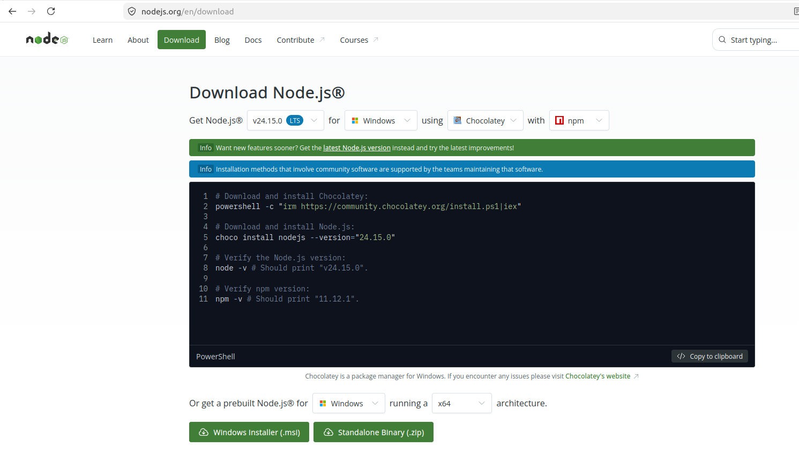
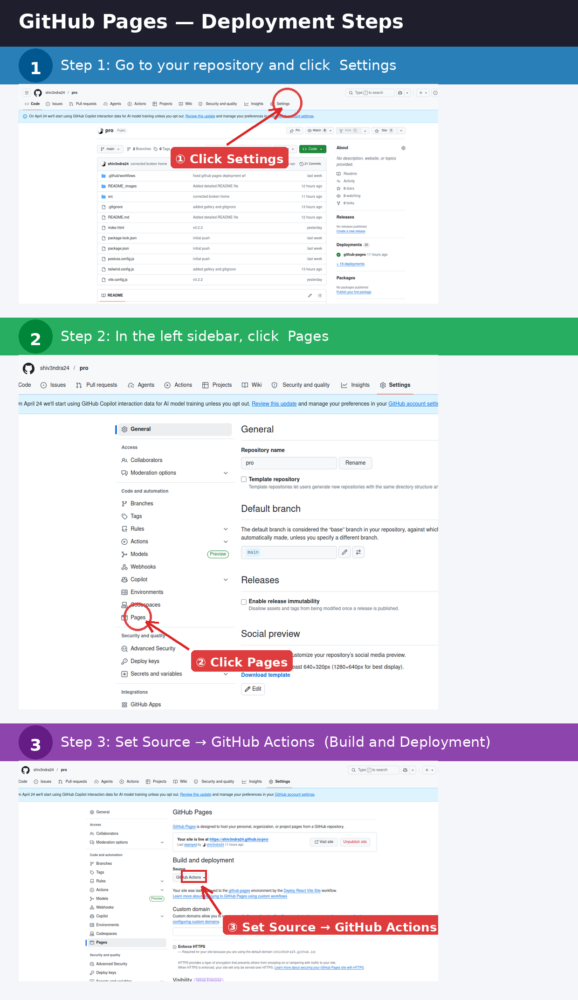

# How to Upload the Website to GitHub — Step by Step

## Part 1 — Install Git and VSCode

### 1.1 Install Git

Git is the tool that tracks and uploads your code.

1. Go to **[https://git-scm.com/downloads](https://git-scm.com/downloads)**
2. Click the download button for your operating system (Windows / macOS / Linux).
3. Run the installer. **Keep clicking "Next" with all the default options** — do not change anything.
4. Once installed, open a terminal to verify:
   - **Windows:** Press `Win + R`, type `cmd`, press Enter.
   - **macOS:** Press `Cmd + Space`, type `Terminal`, press Enter.
5. Type the following and press Enter:
   ```
   git --version
   ```
   You should see something like `git version 2.x.x`. If you do, Git is installed correctly. 

---

### 1.2 Install Visual Studio Code (VSCode)

VSCode is the code editor you will use to manage and upload files.

1. Go to **[https://code.visualstudio.com](https://code.visualstudio.com)**
2. Click the big **Download** button for your operating system.
3. Run the installer with all default options.
4. Open VSCode after installation.

---

### 1.3 Configure Git with Your Name and Email

> ⚠️ This step is required before you can make your first commit. Skip it and Git will throw an error.

Open a terminal (or use the terminal inside VSCode: go to **Terminal → New Terminal** from the top menu (or just press ``Cmd + ` ``)) and run these two commands one by one, replacing the placeholders with your actual name (github name) and email:

```bash
git config --global user.name "Your Name"
git config --global user.email "your@email.com"
```

Use the **same email** you will use for your GitHub account (next step).

---

## Part 2 — Create a GitHub Account and Link It to VSCode

### 2.1 Create a GitHub Account

1. Go to **[https://github.com](https://github.com)**
2. Click **Sign up** and follow the steps to create a free account.
3. Verify your email when GitHub asks you to.

---

### 2.2 Install the GitHub Extension in VSCode

This extension lets VSCode talk to GitHub directly, without needing passwords every time.

1. Open VSCode.
2. Click the **Extensions icon** on the left sidebar (it looks like four squares, or press `Ctrl+Shift+X` / `Cmd+Shift+X`).
3. In the search bar, type: `GitHub Pull Requests`
4. Click **Install** on the extension by GitHub.

---

### 2.3 Sign Into GitHub Inside VSCode

1. In VSCode, click the **Accounts icon** at the bottom-right of the screen (it looks like a person silhouette).
2. Click **Sign in with GitHub**.
3. A browser window will open — log into your GitHub account and click **Authorize**.
4. Return to VSCode. You should now see your GitHub username in the bottom-left.

---

## Part 3 — Create the Repository on GitHub and Open Your Folder in VSCode

### 3.1 Create an Empty Repository on GitHub

1. Go to **[https://github.com](https://github.com)** and log in.
2. Click the **+** icon at the top right → **New repository**.
3. Fill in:
   - **Repository name:** choose a short, lowercase name with no spaces (e.g., `lab-website`)
   - **Description:** optional, you can leave it blank
   - **Visibility:** choose **Public** 
   (For free plan, you have to choose public)
4. ⚠️ **Do NOT check** "Add a README file", "Add .gitignore", or "Choose a license" — leave all those unchecked.
5. Click **Create repository**.
6. You will land on a page showing your new empty repository. **Keep this page open** — you will need the URL in a later step. It looks like:
   ```
   https://github.com/your-username/lab-website.git
   ```

---

### 3.2 Open Your Website Folder in VSCode

1. Open VSCode.
2. Go to **File → Open Folder** from the top menu.
3. Navigate to the folder that contains your completed website files and click **Select Folder** (Windows) or **Open** (macOS).
4. You should now see all your website files listed in the left sidebar of VSCode.

---

## Part 4 — Initialize Git and Push to GitHub

> All the commands below are run in the **VSCode Terminal**. Open it from the top menu: **Terminal → New Terminal**.

---

### 4.1 Initialize Git in the Folder

This sets up Git tracking inside your website folder for the first time.

```bash
git init
```

You should see a message like: `Initialized empty Git repository in ...`

---

### 4.2 Connect Your Folder to the GitHub Repository

This links your local folder to the empty GitHub repo you created in step 3.1. Replace the URL below with **your actual repository URL** from that page:

```bash
git remote add origin https://github.com/your-username/lab-website.git
```

To confirm it worked, run:

```bash
git remote -v
```

You should see your GitHub URL printed twice (once for fetch, once for push). ✅

---

### 4.3 Stage All Files

This tells Git which files to include in the upload:

```bash
git add .
```

The `.` means "everything in this folder". You won't see any output — that's normal.

---

### 4.4 Commit the Files

A commit is a labelled snapshot of your files. The `-m` flag lets you write a short message describing what this commit contains:

```bash
git commit -m "Initial commit — upload website files"
```

You should see a list of files being committed. ✅

---

### 4.5 Push to GitHub

This uploads everything to GitHub. The `-u origin main` part sets GitHub as the default destination for future pushes:

```bash
git push -u origin main
```

> ⚠️ A browser window or a VSCode pop-up may appear asking you to authorize Git. Click **Authorize** or log in when prompted.

Once it finishes, go back to your GitHub repository page and **refresh it** — your files should now be visible there. ✅

---

## 🔄 Next Time You Make Changes

Whenever you update the website files, you only need to run these three commands:

```bash
git add .
git commit -m "Describe what you changed"
git push
```

---

## ❓ Common Problems

**`git push` says "error: src refspec main does not match any"**
→ Your first commit may not have been created. Make sure you ran `git commit` before pushing.

**"Permission denied" or "Authentication failed"**
→ Make sure you are signed into GitHub inside VSCode (see step 2.3) and try again.

**"remote origin already exists"**
→ Run `git remote remove origin` and then redo the `git remote add origin <URL>` command.

---

## Part 5 — Running the Website Locally

Before pushing any changes to GitHub, you can preview the website live on your own computer using a local server.

---

### 5.1 Install Node.js and npm

npm (the tool that installs and runs the website) comes bundled with Node.js.

1. Go to **[https://nodejs.org](https://nodejs.org)**
2. Click **"Get Node.js"**.
3. Leave all the dropdown options as they are — they auto-detect your system.
4. Click **Windows Installer (.msi)** and run the installer with all default options.



---

### 5.2 Add npm to Your System PATH (Windows only)

> macOS and Linux users can skip this step — PATH is set automatically.

PATH is a list your computer uses to find programs. If it doesn't include npm, the terminal won't recognise npm commands.

1. Press `Win + S` and search for **"Environment Variables"** → click **"Edit the system environment variables"**.
2. In the window that opens, click **"Environment Variables..."** at the bottom.
3. Under **"System variables"**, scroll down and double-click **Path**.
4. Check if any entry already contains `nodejs`. If yes — you're done, skip to 5.3. ✅
5. If not, click **New** and add: `C:\Program Files\nodejs\`

6. Click **OK** on all windows to close them.
7. **Close and reopen your terminal** (changes only apply to new terminal windows).

---

### 5.3 Verify Installation

Open a terminal (or VSCode Terminal: **Terminal → New Terminal**) and run:

```bash
node --version
npm --version
```

Both should print a version number (e.g., `v20.x.x` and `10.x.x`). ✅

---

### 5.4 Install Project Dependencies

This downloads all the packages the website needs to run. You only need to do this **once per computer** — as long as you don't delete the `node_modules` folder, you never need to run it again.

Make sure your website folder is open in VSCode, then in the terminal run:

```bash
npm install
```

This may take a minute. It will create a folder called `node_modules` in your project.

---
### 5.5 ⚠️ Before Starting — Pull the Latest Changes

#### **Important:**
 Every time you sit down to work, before running the website or editing any files, always run:

```bash
git pull
```

This downloads any changes that were pushed to GitHub by someone else (or from another computer or from the website itself) and keeps your local copy up to date. Skipping this can cause conflicts later when you try to push your own changes.

---


### 5.6 Start the Local Development Server

```bash
npm run dev
```

Once it starts, the terminal will show a local address like: `Local:   http://localhost:3000`

Open that link in your browser — you are now viewing the website live on your computer. Any changes you save to the files will automatically refresh in the browser.

To **stop** the server, click in the terminal and press `Ctrl + C`.

---

## Now Pushing to GitHub

Then proceed with the usual push:

```bash
git add .
git commit -m "Describe what you changed"
git push
```

---

# Deploying the Website with GitHub Pages

Once your code is on GitHub, you can make it publicly accessible for free using GitHub Pages.

---

## Step 1 — Set the Base Path in `vite.config.js`

Open the file `vite.config.js` in VSCode (it is in the root of your project folder, not inside `src/`).

Replace its entire contents with the following, changing `/pro/` to `/your-repository-name/` — use the exact name of the GitHub repository you created in step 3.1:

```js
import { defineConfig } from 'vite'
import react from '@vitejs/plugin-react'

export default defineConfig({
  plugins: [react()],
  base: '/your-repository-name/',
})
```

For example, if your repository is named `lab-website`, it should be:

```js
  base: '/lab-website/',
```

Save the file, then push the change to GitHub:

```bash
git add .
git commit -m "Set base path for GitHub Pages"
git push
```

---

## Step 2 — Enable GitHub Pages in Repository Settings

1. Go to your repository on **[https://github.com](https://github.com)**.
2. Click the **Settings** tab (near the top of the repository page).
3. In the left sidebar, click **Pages**.
4. Under **Build and deployment**, find the **Source** dropdown and select **GitHub Actions**.




GitHub will now automatically build and publish your site every time you push to the `main` branch. After the first push, wait about 1–2 minutes, then visit:


```
https://your-username.github.io/your-repository-name/
```

> ✅ You can check the progress of the deployment under the **Actions** tab of your repository.

---

## Step 3 — (Optional) Use `username.github.io` as the URL Instead

By default, your site will be accessible at `https://your-username.github.io/your-repository-name/`. If you would prefer the cleaner URL `https://your-username.github.io` (with no repository name in the path), follow these steps:

1. **Rename your repository** to exactly `your-username.github.io` — for example, if your GitHub username is `dsalab`, the repository must be named `dsalab.github.io`.
   - You can rename it under **Settings → General → Repository name**.

2. **Update `vite.config.js`** — change the `base` field to just `/` (a single forward slash), since the site now lives at the root of the domain:

   ```js
   import { defineConfig } from 'vite'
   import react from '@vitejs/plugin-react'

   export default defineConfig({
     plugins: [react()],
     base: '/',
   })
   ```

3. **Push the change** and your site will be live at `https://your-username.github.io`.

> ⚠️ Each GitHub account can only have one repository of this special `username.github.io` type. If you already have one, stick with the regular repository name approach from Steps 1–2.

---

# Making Common Changes to the Website

> All files mentioned below are inside the `src/` folder. Open them by clicking on them in the VSCode left sidebar.

---
### 6.1 Editing the Home Page

#### Stats Bar (Lab Members, Publications, etc.)

Open `src/pages/Home.jsx`. At the very top of the file you will see:

```js
const STATS = [
  { value: '12+', label: 'Lab Members'       },
  { value: '40+', label: 'Publications'      },
  { value: '6',   label: 'Active Projects'   },
  { value: '8',   label: 'Industry Partners' },
]
```

Just change the `value` numbers directly. Do not change the structure.

---

#### News & Updates

A little further down you will see the `NEWS` array:

```js
const NEWS = [
  {
    date: 'April 2025',
    tag:  'Award',
    text: 'PIANO paper receives Best Paper Honourable Mention at WWW 2025.',
  },
  ...
]
```

**To add a new entry**, paste a new block at the top of the list (so newest news appears first):

```js
{
  date: 'June 2025',
  tag:  'Grant',
  text: 'DSA Lab receives funding from MeitY for explainable AI research.',
},
```

**To remove an entry**, delete its entire `{ ... },` block.

---

#### Other Text (Welcome section, lab description)

Use `Ctrl + F` to search for the phrase you want to change and edit it directly in the file. Save with `Ctrl + S`.

### 6.2 Adding or Editing a Research Entry

1. Open `src/pages/Research.jsx`.
2. Press `Ctrl + F` and search for an existing research entry to understand the format — it will look something like:
```jsx
   {
    id:      '02',
    title:   'Influence Maximization',
    tagline: 'Seeding strategies that maximise ....',
    body: 'Influence Maximization (IM) asks .....',
    keywords: ['Seed-set selection', 'Cascade model'],
  },
```
3. Copy an existing entry, paste it below, and fill in the new details.
4. Save the file.

---

### 6.3 Adding or Editing a Publication

1. Open `src/pages/Publications.jsx`.
2. Press `Ctrl + F` and search for an existing publication to see the format -- it will look something like this:
```jsx
  {
    year: '2025',
    venue: 'WWW 2025',
    title: 'PIANO: Probabilistic ...',
    authors: 'A. Mehta, R. Sharma',
    tag: 'Best Paper HM',
    link: '', 
  },
```
3. Copy an existing entry, paste it, and update the fields (title, authors, venue, year, link etc.).
4. Save the file.

---

### 6.4 Adding or Editing a Facility Entry

Facility entries live in `src/pages/Facility.jsx`. Photos for facilities are stored separately.

**To edit text:**
1. Open `src/pages/Facility.jsx`.
2. Use `Ctrl + F` to find the entry you want to change and edit it directly.

**To add a new facility with a photo:**
1. Save your image file inside `src/assets/facilities/`. Give it a simple lowercase name.
2. In `Facility.jsx`, find an existing entry that has an image and copy its format:
```jsx
   {
    id: '03',
    title: 'Data Collection Support Equipment',
    description: 'Portable equipment used f...',
    image: 'facility-3.jpg',
  },
```
3. Paste and update with your new facility's details.
4. Save the file.

---

### 6.5 Updating the Team Page

The team page is split into two files:
- **`src/pages/Team.jsx`** — controls how the page looks (edit only for display info, not member details).
- **`src/pages/teamData.js`** — controls the member details. **This is the main file you need to edit.**

Open `src/pages/teamData.js`. You will see separate sections for Faculty, PhD scholars, Masters students, Undergrads, and Alumni. Each person follows this format:

```js
{
  name:     'Full Name',
  role:     'Ph.D. Scholar — 2nd Year',
  degree:   'B.Tech., IIT Delhi',
  focus:    'One line describing their research focus.',
  email:    'their@email.com',
  image:    'filename.jpg',          // or null if no photo
  link:     'https://theirwebsite.com',   // or null
  scholar:  'https://scholar.google.com/...',  // or null
  linkedin: 'https://linkedin.com/in/...',     // or null
  cv:       'https://link-to-cv.pdf',          // or null
},
```

**Rules:**
- Set any field to `null` if it doesn't apply — do not leave it blank or delete it.
- All links **must start with `https://`** — links without it will not work.
- To add a new person, copy an existing entry in the correct section, paste it at the end of that section (before the closing `]`), and fill in the details.
- To remove someone, delete their entire `{ ... },` block.

**To add a profile photo:**
1. Save the photo inside `src/assets/people/`. 
2. In `teamData.js`, set the `image` field to just the filename:
```js
   image: 'rahul-joshi.jpg',
```

**Example — adding a new PhD student:**
```js
// Inside the PHD array, add at the end before the closing ]
{
  name:     'Vikram Singh',
  role:     'Ph.D. Scholar — 1st Year',
  degree:   'B.Tech., IIT Bombay',
  focus:    'Distributed graph algorithms....',
  email:    'vikram@iit.ac.in',
  image:    'vikram-singh.jpg', // saved in src/assets/people/
  link:     'https://vikramsingh.com',
  scholar:  'https://scholar.google.com/citations?user=XXXXX',
  linkedin: 'https://linkedin.com/in/vikram-singh',
  cv:       null,
},
```

---

### 6.6 Updating the Gallery Page

Gallery entries are managed in `src/pages/galleryData.js`. Photos are stored in `src/assets/gallery/`.

**To add a new photo:**
1. Save the image inside `src/assets/gallery/`.
2. Open `src/pages/galleryData.js` and add a new entry following the existing format:
```js
   {
    title:    '2012 · Delhi',
    subtitle: 'Yamuna river sediment coring expedition',
    photos: [
      { file: 'yama dixit.png', caption: 'Core extraction at Yamuna bank' },
      { file: 'delhi_2012_02.jpg', caption: 'Lab setup at base camp'         },
      { file: 'delhi_2012_03.jpg', caption: 'Team briefing — Day 1'          },
      { file: 'delhi_2012_04.jpg', caption: 'Sediment layering — 4 m depth'  },
      { file: 'delhi_2012_05.jpg', caption: 'Packing cores for transport'     },
    ],
  },
```
3. Make sure the filename in `src` **exactly matches** the file you saved in the gallery folder - including capitalisation.
4. Save the file.

> ⚠️ If the name in `galleryData.js` and the actual filename don't match, the image will not appear on the website.

---

### 6.8 Adding or Editing a Project Entry

Project entries are managed directly inside `src/pages/Projects.jsx`. Open that file — near the top you will see the `PROJECTS` array. Each entry looks like this:

```js
{
  id: '01',
  title: 'Temporal Graph Stream Processing',
  status: 'Completed',
  summary: 'One-line summary shown on the left panel of the card.',
  description: `
    Longer paragraph shown on the right side of the card.
    You can use multiple lines — just keep them inside the backticks.
  `,
  researchers: [
    'Prof. Yama Dixit',
    'Priya Nair',
    'Rahul Joshi',
  ],
  photos: [
    { file: 'my-photo.jpg', caption: 'Optional short caption' },
  ],
},
```

**To add a new project**, copy an existing entry, paste it at the end of the array (before the closing `]`), and fill in the details.

**To remove a project**, delete its entire `{ ... },` block.

---

#### Adding Photos to a Project Card

Each project card can display a scrollable row of photo thumbnails. Clicking any thumbnail opens a full-screen lightbox.

**Step 1 — Save your image**

Put the image file inside `src/assets/project-photos/`. Use a simple lowercase filename with no spaces (e.g. `stream-processing-01.jpg`).

**Step 2 — Add it to the project entry**

In `src/pages/Projects.jsx`, find the project you want and add to its `photos` array:

```js
photos: [
  { file: 'stream-processing-01.jpg', caption: 'Lab session — January 2024' },
  { file: 'stream-processing-02.jpg', caption: 'Dataset visualisation'       },
],
```

- `file` — the filename only (not a full path). Must exactly match the file in `src/assets/project-photos/`, including capitalisation.
- `caption` — optional short label shown under the photo in the lightbox. You can omit it: `{ file: 'photo.jpg' }`.

**To show no photos** for a project, leave the array empty:

```js
photos: [],
```

The thumbnail strip is hidden automatically — nothing broken, nothing shown.

> ⚠️ Photos for projects live in `src/assets/project-photos/` — a separate folder from the Gallery photos which live in `src/assets/gallery/`. Keep them in the right folder or the image will not load.

---

### 6.7 Footer

The footer is in a different location from the other pages — open `src/components/Footer.jsx`.

**To change the contact address or room number**, find the address block near the bottom of the file and edit directly:

```jsx
<p>Room 312, Dept. of Computer Science &amp; Engineering</p>
<p>Indian Institute of Technology</p>
```

**To change the contact email**, find:

```jsx
<a href="mailto:dsalab@iit.ac.in" ...>
  dsalab@iit.ac.in
</a>
```

Update both the `href` (the part after `mailto:`) and the visible text to your new email address.

> ⚠️ Note the `&amp;` in the footer text — this is how an `&` symbol is written inside JSX. Do not replace it with a plain `&` or it will cause an error.